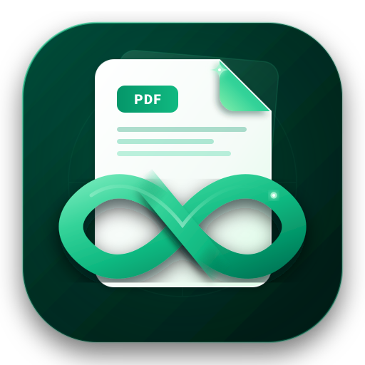

# OmniPDF Studio

<p align="center">
  
</p>

<p align="center">
  <strong>100% Client-Side, Multiplatform Offline PDF Manipulation Suite</strong><br>
  <em>Aman, Cepat, Tanpa Server, dan Privasi Dokumen Terjamin Sepenuhnya.</em>
</p>

<p align="center">
  <a href="https://github.com/VelAstra/Project-Capstone-JH/releases/tag/v1.2.4"></a>
  <a href="LICENSE"></a>
  
  
</p>

---

## 📌 Ringkasan Proyek

> **Project Capstone** dibawah bimbingan **Bapak Janoe Hendarto**.  
> **OmniPDF Studio** adalah aplikasi manipulasi dan pengolahan dokumen PDF multiplatform (Windows, macOS, Linux, dan Android) yang beroperasi **100% secara offline** di sisi klien (*client-side*). Seluruh proses komputasi, enkripsi, rendering, dan konversi dokumen berjalan langsung di perangkat pengguna tanpa transmisi data ke server eksternal mana pun.

---

## 📥 Unduh Installer Aplikasi Langsung (Siap Pakai Tanpa CLI)

Pengguna tidak perlu menjalankan perintah terminal ataupun instalasi environment yang rumit. Cukup unduh berkas yang sesuai dengan sistem operasi Anda dari [GitHub Releases v1.2.7](https://github.com/VelAstra/Project-Capstone-JH/releases/tag/v1.2.7):

| Platform | Format Berkas | Ukuran | Arsitektur Runtime | Tautan Unduhan Langsung |
| :--- | :--- | :--- | :--- | :--- |
| 🪟 **Windows** | `.exe` (Single File) | **~3.12 MB** | Native Microsoft Edge WebView2 (.NET) | [Unduh OmniPDF-Studio-Windows-x64.exe](https://github.com/VelAstra/Project-Capstone-JH/releases/download/v1.2.7/OmniPDF-Studio-Windows-x64.exe) |
| 🍎 **macOS** | `.dmg` | **~4.46 MB** | Tauri v2 + Apple WKWebView | [Unduh OmniPDF-Studio-macOS.dmg](https://github.com/VelAstra/Project-Capstone-JH/releases/download/v1.2.7/OmniPDF-Studio-macOS.dmg) |
| 📱 **Android** | `.apk` | **~5.67 MB** | Android System WebView (Capacitor) | [Unduh OmniPDF-Studio-Android.apk](https://github.com/VelAstra/Project-Capstone-JH/releases/download/v1.2.7/OmniPDF-Studio-Android.apk) |
| 🐧 **Linux** | `.deb` (Debian/Ubuntu) | **~2.90 MB** | Tauri v2 + System WebKitGTK 4.1 | [Unduh OmniPDF-Studio-Linux.deb](https://github.com/VelAstra/Project-Capstone-JH/releases/download/v1.2.7/OmniPDF-Studio-Linux.deb) |
| 📄 **Dokumentasi** | `.pdf` (LaTeX) | **~0.24 MB** | Laporan Rekayasa IEEE (10 Halaman Lengkap) | [Unduh OmniPDF-Studio-Technical-Report.pdf](https://github.com/VelAstra/Project-Capstone-JH/releases/download/v1.2.7/OmniPDF-Studio-Technical-Report.pdf) |

---

## 🛠️ Daftar Lengkap 26+ Fitur Manipulasi PDF

OmniPDF Studio menyediakan rangkaian alat pengolahan PDF komprehensif yang terbagi ke dalam 7 kategori utama:

```
OmniPDF Studio
 ├── 📄 Manipulasi Halaman (Merge, Split, Organize, Rotate, Remove, Extract)
 ├── ✍️ Edit & Anotasi (Drawing Canvas, Digital Signature, Watermark, Page Numbers, Flatten)
 ├── 🔄 Konversi dari PDF (PDF to JPG, PDF to Text, Extract Images, Offline OCR)
 ├── 📥 Konversi ke PDF (PPTX to PDF, Image to PDF, HTML to PDF)
 ├── 🔒 Keamanan & Optimasi (AES Protect, Password Unlock, Compress, Metadata Editor)
 ├── 📐 Tata Letak & Cetak (N-Up Multi-Page, Margin Cropping, Page Resizing)
 └── 🤖 Kecerdasan Dokumen (AI Summarizer, Multi-Language Translator)
```

### 📄 A. Manipulasi Halaman (Manipulate PDF)
1. **Merge PDF**: Menggabungkan banyak dokumen PDF menjadi satu berkas secara berurutan dengan opsi penataan dinamis.
2. **Split PDF**: Memisahkan dokumen berdasarkan rentang halaman kustom (misal: `1-3, 5, 8-10`) atau memecah per lembar.
3. **Organize PDF**: Mengatur urutan halaman secara interaktif melalui kartu thumbnail *drag-and-drop*, membalik urutan, atau menghapus halaman tertentu.
4. **Rotate PDF**: Memutar orientasi halaman (90°, 180°, 270°) untuk lembar tertentu maupun sekaligus seluruh dokumen.
5. **Remove Pages**: Menghapus satu atau banyak halaman yang tidak diinginkan dengan memilih kartu preview.
6. **Extract Pages**: Mengambil halaman-halaman spesifik dan mengekspornya menjadi berkas PDF mandiri baru.

### ✍️ B. Edit & Tambah Konten (Edit & Annotate)
7. **Visual PDF Editor**: Kanvas interaktif untuk menggambar bebas (*freehand pencil*), menambahkan teks kustom, garis penyorot (*highlighter*), bentuk geometris kotak/lingkaran, serta riwayat *undo/redo*.
8. **Sign PDF (Tanda Tangan Digital)**: Modal interaktif penoreh tanda tangan dengan *Signature Pad*, dapat diatur ukuran, warna goresan, posisi peletakan, dan dibubuhkan langsung ke lembaran PDF.
9. **Watermark (Tanda Air)**: Membubuhkan cap teks kepemilikan/kerahasiaan dengan opsi transparansi (*opacity*), ukuran huruf, rotasi, dan palet warna.
10. **Page Numbers**: Menambahkan nomor halaman otomatis (`Halaman n dari total`) dengan beragam opsi perataan (bawah-tengah, bawah-kanan, atas).
11. **Flatten PDF**: Meratakan formulir interaktif dan anotasi menjadi konten statis permanen yang tidak dapat diubah kembali.

### 🔄 C. Konversi dari PDF (Convert from PDF)
12. **PDF to JPG**: Merender setiap halaman PDF menjadi berkas gambar JPG beresolusi tinggi dengan opsi unduh massal format ZIP.
13. **PDF to Text**: Mengekstrak seluruh teks dari dokumen PDF ke dalam berkas teks murni (.txt).
14. **Extract Images**: Mendeteksi dan mengekstrak semua elemen gambar tersemat di dalam file PDF ke berkas gambar terpisah.
15. **OCR PDF (Optical Character Recognition)**: Mengenali teks pada lembaran hasil scan fisik menggunakan engine Tesseract.js offline.

### 📥 D. Konversi ke PDF (Convert to PDF)
16. **PPT to PDF**: Mengonversi presentasi PowerPoint (.pptx) menjadi format cetak dokumen PDF.
17. **JPG to PDF**: Menggabungkan banyak gambar foto/scan (JPG, PNG) menjadi satu berkas PDF dengan opsi orientasi dan margin.
18. **HTML to PDF**: Merender dokumen berbasis markup HTML menjadi lembaran PDF cetak.

### 🔒 E. Keamanan & Optimasi (Security & Optimize)
19. **Compress PDF**: Merampingkan ukuran byte dokumen dengan mengompresi gambar dan merestrukturisasi alur objek stream.
20. **Protect PDF**: Mengunci dan mengenkripsi dokumen dengan kata sandi (*AES password encryption*).
21. **Unlock PDF**: Membuka kunci dokumen terproteksi password yang sah.
22. **PDF Metadata**: Melihat dan menyunting informasi metadata dokumen (*Title, Author, Subject, Keywords, Creator*).

### 📐 F. Tata Letak & Cetak (Layout & Print)
23. **Pages Per Sheet (N-Up)**: Menyusun multi-halaman dalam satu lembar cetak (2 halaman per lembar, 4 halaman, 9 halaman, atau 16 halaman).
24. **Crop PDF**: Memangkas batas margin putih pada dokumen secara proporsional.
25. **Change Page Size**: Mengubah ukuran standar lembaran PDF (A4, US Letter, Legal, Tabloid).

### 🤖 G. Kecerdasan Dokumen (Intelligence)
26. **AI Summarizer & Translate**: Analisis rangkuman poin-poin penting isi dokumen dan penerjemahan teks multi-bahasa.

---

## 🎨 Desain Antarmuka & Palet Warna Flat

Aplikasi mengusung estetika **Flat Design** modern dengan kontras warna yang nyaman untuk penggunaan intensif:

### ☀️ Mode Terang (Light Mode)
* `#FBFFE4` : Latar belakang aplikasi (*App Background*)
* `#3D8D7A` : Warna primer untuk tombol aksi utama, header aksen, dan status aktif
* `#B3D8A8` : Warna aksen untuk garis batas (*borders*) kartu dan sorotan elemen
* `#A3D1C6` : Latar belakang bilah sisi (*sidebar*) dan kontainer kartu sekunder
* `#092328` : Teks utama berdaya kontras tinggi

### 🌙 Mode Gelap (Dark Mode)
* `#092328` : Latar belakang aplikasi (*Deep Slate Background*)
* `#12544F` : Permukaan bilah sisi (*sidebar*) dan kartu fitur (*card background*)
* `#2A835F` : Warna primer tombol aksi utama dan indikator aktif
* `#8BBB92` : Warna aksen untuk teks sekunder, ikon, dan garis batas halus
* `#FBFFE4` : Teks utama kontras terang

> **Pengalih Tema Instan:** Tombol matahari/bulan di bagian atas (*header*) dan di bilah sisi (*sidebar*) memungkinkan peralihan instan antara tema terang dan gelap, tersimpan otomatis di `localStorage`.

---

## 💻 Arsitektur & Teknologi

* **Frontend**: HTML5, Modern CSS3 (Grid & Flexbox), Vanilla JavaScript (ES2022).
* **PDF Engines**:
  * [PDF-Lib](https://pdf-lib.js.org/) untuk manipulasi struktur, modifikasi halaman, dan enkripsi.
  * [PDF.js](https://mozilla.github.io/pdf.js/) dari Mozilla untuk perenderan halaman dan ekstraksi kanvas.
  * [Tesseract.js](https://tesseract.projectnaptha.com/) untuk pengenalan karakter optik (OCR) offline.
  * [Signature Pad](https://github.com/szimek/signature_pad) untuk pembuatan tanda tangan digital berbasis vektor.
  * [JSZip](https://stuk.github.io/jszip/) untuk pengemasan unduhan arsip batch.
* **Desktop Wrappers & Native WebView Hosts**:
  * **Windows**: [.NET 10 Windows Forms Host](https://dotnet.microsoft.com/) dengan runtime bawaan Microsoft Edge WebView2 (~3.12 MB single-file standalone executable).
  * **macOS**: [Tauri v2](https://tauri.app/) dengan core Rust dan Apple WKWebView (~4.46 MB DMG).
  * **Linux**: [Tauri v2](https://tauri.app/) dengan WebKitGTK 4.1 (~2.90 MB native Debian/Ubuntu `.deb` package).
* **Mobile Shell**:
  * [Capacitor Android](https://capacitorjs.com/) dengan Android System WebView (~5.67 MB APK).

---

## 🚀 Panduan Pengembangan Lokal (Developer Setup)

### Prasyarat
* [Node.js](https://nodejs.org/) versi 18 atau lebih baru.
* [Rust & Cargo](https://rustup.rs/) (untuk membangun versi macOS/Linux melalui Tauri v2).
* [.NET 10 SDK](https://dotnet.microsoft.com/download) (untuk mengompilasi Windows Native Host).

### Langkah-Langkah

1. **Clone Repository**:
   ```bash
   git clone https://github.com/VelAstra/Project-Capstone-JH.git
   cd Project-Capstone-JH
   ```

2. **Instal Dependensi & Siapkan Web Assets**:
   ```bash
   npm install
   npm run prepare:dist
   ```

3. **Jalankan Uji Otomatis**:
   ```bash
   npm test
   ```

4. **Kompilasi Standalone Windows Host (.NET 10 Lite ~3 MB)**:
   ```bash
   dotnet publish host/OmniPdfStudio.csproj -c Release -r win-x64 -p:PublishSingleFile=true -p:IncludeNativeLibrariesForSelfExtract=true --output host-publish
   ```

5. **Kompilasi Desktop via Tauri v2**:
   ```bash
   npm run build:tauri
   ```

---

## 📜 Lisensi & Atribusi

* **Bimbingan Proyek**: Bapak Janoe Hendarto
* **Lisensi**: Proyek ini dilisensikan di bawah lisensi terbuka [GNU General Public License v3.0 (GPL-3.0)](LICENSE).
